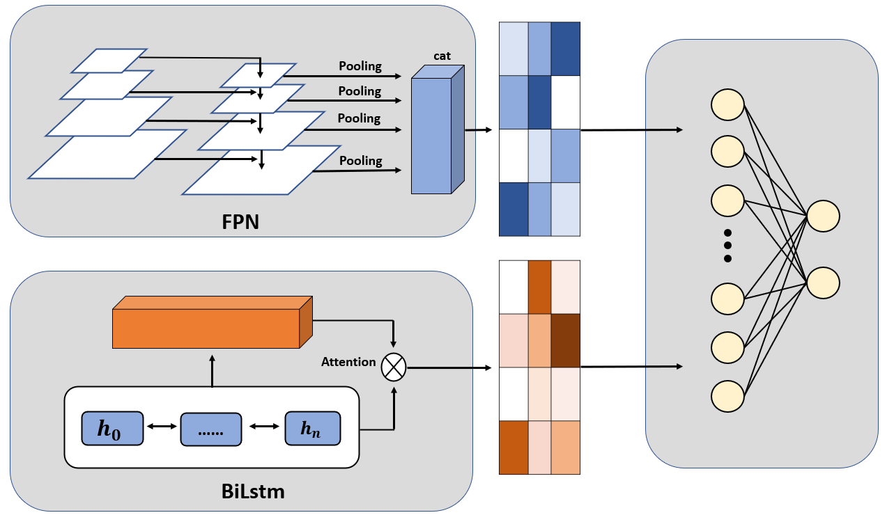

# BioFormer
Efficiently predicting Drug Target Interaction

***
## Requirements
To install the TDC package, open the terminal and type: 
```shell
pip install PyTDC
```
***
## Datasets
In the data folder, we provide all three 
processed datasets used in our model: 
BindingDB_Kd, KIBA, and DUDE. Besides drug smiles
and protein sequence, we provide protein pdb
as well as contactmap.

### To prepare the datasets:

1. Download my_data.zip: https://drive.google.com/file/d/1fz8EZBOKFplIBugsX2eueR65ZHBBgEre/view?usp=sharing
2. Create a new folder my_data under data  
3. Unzip my_data.zip in my_data  

You should see the following data structure:
```angular2html
--data
----my_data
------my_data
--------bindingdb
--------dude
--------kiba
```
***
## Run
To train on kd, kiba or dude, simply run  
bash train.sh [dataset], dataset is one of kd, kiba or dude  
For example, train on kd, you should run:  
```shell
bash train.sh kd
```
To view the logs while training, run bash view.sh [dataset]
```shell
bash view.sh kd
```


